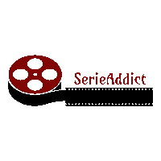

# SerieAddict

In this project we created a streaming site inspired by Netflix. The goal of our project is to display a catalog of films recovered from the TheMovieDB API.

We have created a session system: registration, login / logout. A search bar, and different sort by genre of the film. Different rights like Administrator who can change the status of the users, the password, the mail ... erase comments on the films and block users to make comments.

** What does it look like? **  (https: // pawelPrzewoznik / Getflix)

## Built with

To create our site, we used html / css, bootstrap, JS, Jquery, php, sql and mysql.

## Autheurs

* **Aguera, Isabel** - [IsabelAguera](https://github.com/IsabelAguera)

* **Link LinkedIn** : (https://www.linkedin.com/in/isabel-aguera-b12071191/)

* **Przewoznik, Pawel** - [pawelPrzewoznik](https://github.com/pawelPrzewoznik)

* **Link LinkedIn** : (https://www.linkedin.com/in/pawel-przewoznik-9aa074191/)

* **Boubker Hani** - [Hanioch](https://github.com/Hanioch)

* **Link LinkedIn** : (https://www.linkedin.com/in/hani-boubker/)

* **Assecoum, Yassin** - [yassinassecoum](https://github.com/yassinassecoum)

* **Link LinkedIn** : (https://www.linkedin.com/in/yassin-assecoum/)

